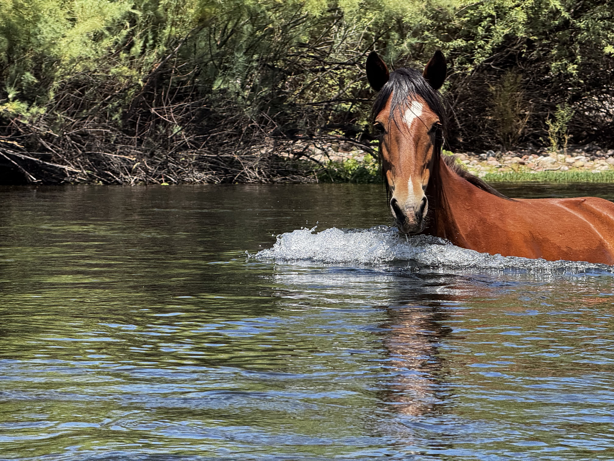

Just got back from an awesome weekend trip to Phoenix, and I’m jotting this down at the airport while it’s still fresh. Buckle up for a recap of a rough flight, some great food, a ghost town, and an unforgettable float down the Salt River.

## The Flight In - Meh
I flew from DFW to PHX, and let’s just say the flight was *memorable* for all the wrong reasons. A beam of light from a window three rows up was reflecting through the seat gaps, hitting me square in the face. Thank goodness the middle seat was empty, so I could lean over and dodge the laser show. I asked a flight attendant if they could ask the person to lower their shade a couple of inches, but no dice—they wouldn’t do it. Oh well. To top it off, I was in the aisle seat right by the bathroom, which I’m now calling “the fart seat” of the plane. It actually wasn't really too bad, but this is the seat they stick you in when you don't pay to choose a seat. This is the gamble you make when you don't pay the extra thirty-six dollars. Normally, when people ask, “How was your flight?” I’ve got nothing to say other than "It was alright" because I have a pretty high bar of tolerance for irritating things, but this flight cleared the bar.

## Landing in Phoenix: Sushi and Mario Kart
Once I landed, my buddy Jared picked me up, and we headed straight to Harumi Sushi in downtown Phoenix. I tried their Blue Fin Toro, Kurodai, and Wakame (seaweed salad). It was delicious. After that, we headed to his place in Apache Junction, fired up Mario Kart World for a few rounds, and crashed for the night.

## Saturday: Ghost Town Vibes
Saturday morning, we chilled at Jared’s place, catching up over breakfast he whipped up. Around 9 AM, we headed to Goldfield Ghost Town, a tourist spot that was once a major gold mine in the late 1800s/early 1900s until it flooded. We did a tour through a replica mine, hopped on a mini-train that looped around the property, and checked out the “Mystery Shack”—a trippy building tilted at a 45-degree angle where the tour guide played the part of an old-timey resident. The Superstition Mountains nearby were stunning, and I snagged some solid pics.

That night, we hit Venezia’s, a pizza joint. Jared’s one of the rare folks who loves anchovies like I do, so we got a pie loaded with pepperoni, mushrooms, and anchovies, plus some hot wings. Stuffed and happy, we headed back to rest up for Sunday’s big plan—tube floating down the Salt River, my idea, and I was pumped.

## Sunday: Salt River Adventure
We were up at 6 AM and out the door by ~6:45 to pick up our tubes by 7 AM, but we rolled in closer to 7:30. No biggie. After getting some advice, the plan was to drop in at Pebble Beach, but Jared’s Tesla Model 3 was low on battery, and we weren’t sure it’d make it back. So, we detoured to a supercharger about 30 minutes away, juiced up, and then headed to Pebble Beach. We inflated our tubes, walked to the river, and jumped in. We were initially a bit worried about the heat wave temperatures, but the temperature was actually quite nice - especially on the water.

The Salt River was unreal. Gorgeous scenery, with just enough rapids to keep things exciting (for tubes and no paddles, anyway) but never too sketchy. About 45 minutes in, we spotted wild horses munching on river plants and crossing the water. One horse passed just a few feet from Jared—such a cool moment! When we hit our exit point at Goldfield, we hopped out, grabbed an Uber back to Pebble Beach, and headed home to shower.

## Wrapping Up with Korean BBQ
To cap off the trip, we went to Manna BBQ, an all-you-can-eat Korean BBQ spot. It was crazy good, but we definitely overdid it—AYCE is hard to resist! I might skip food tomorrow to recover. After lunch, Jared dropped me off at the airport, and here I am, writing this at my gate.

## Final Thoughts
This trip was packed with good times, great food, and some wild moments. I had been looking forward to a quick weekend getaway to catch up with Jared, and Arizona delivered. I’m already looking forward to the next adventure. Definitely excited to do something like the river float again with Mary!
